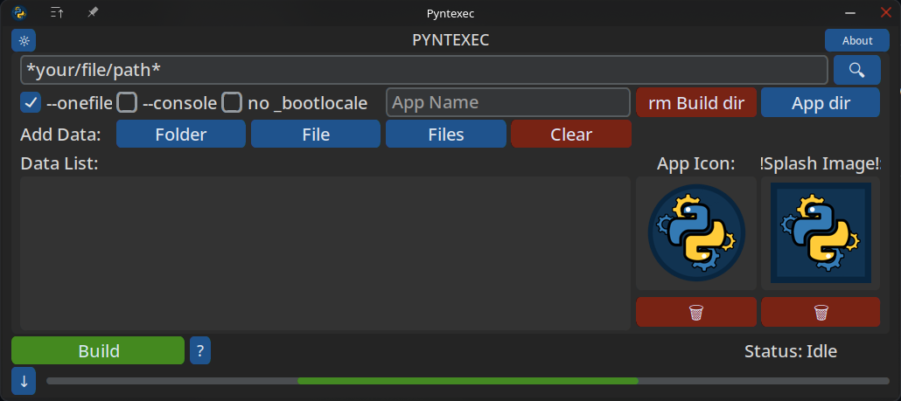

# Pyntexec

**Pyntexec** is a graphical user interface (GUI) tool built with [CustomTkinter](https://customtkinter.tomschimansky.com/) that helps you easily package Python scripts into standalone executables using [PyInstaller](https://pyinstaller.org/). It is designed to simplify the process of building distributable applications from your Python code, providing options for one-file or one-folder builds, icon selection, and more.



## Features

- Simple and intuitive CustomTkinter-based GUI
- Select Python scripts to compile
- Choose between one-file or one-folder output
- Add custom icons to your executables (windows support only)
- Add a splash image (you must unload the image manually from within your script using [pyi](https://pypi.org/project/pyi/))
- Include additional data files or folders
- Toggle console/terminal window visibility (needed if your script has no GUI and runs in the terminal)
- View build progress and status
- Open the output directory after build
- Cross-platform support (Windows, Linux)

## Requirements

- Python 3.7+ (should be fine even though i've only tested it with 3.13.5)
- [PyInstaller](https://pyinstaller.org/) installed on your system (`pip install pyinstaller`)
- [CustomTkinter](https://customtkinter.tomschimansky.com/), installed with (`pip install customtkinter`)

> **Note:**  
> Due to the way Pyinstaller is used, this app cannot be compiled, as a result there are no binaries.
> Due to PyInstaller limitations, Pyntexec cannot bundle PyInstaller itself.

## Installation

Clone this repository or download the source code:

```sh
git clone https://github.com/Nagarafas/pyntexec.git
cd pyntexec
```

Install dependencies (if needed):

```sh
pip install pyinstaller customtkinter

```

## Usage

Run the app:

```sh
python pyntexec.pyw
```

1. Select the Python script you want to compile.
2. Choose build options (onefile/onedir, icon, data, etc.).
3. Click **Build**.
4. After the build completes, the output folder will open automatically, if not there is a button for it.

## Unloading Splash Images

add this block in your script:
>ensure that Pyi is installed (pip install pyi)

```python
try:
    import pyi_splash
    pyi_splash.update_text('UI Loaded ...')
    pyi_splash.close()
except:
    print("PyInstaller splash screen not available, continuing without it.")
``` 

## Limitations

- Pyntexec requires PyInstaller & CustomTkinter to be installed on the system.
- Building executables from within a frozen Pyntexec app is not supported and thus no compiled binaries will be shipped.
- Some advanced PyInstaller options may not be exposed in the GUI, I might add a textbox later for extra options.

## License

MIT License

## Credits

- [PyInstaller](https://pyinstaller.org/)
- [CustomTkinter](https://customtkinter.tomschimansky.com/)
